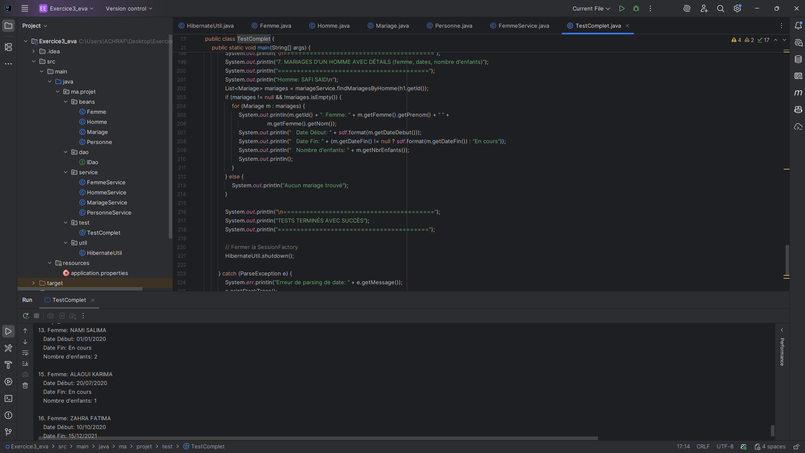
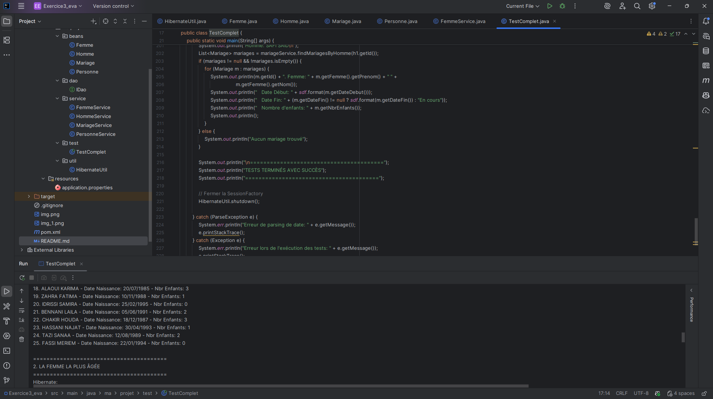

# Application de Gestion de l'État Civil

## Description
Application de gestion de l'état civil permettant de gérer les citoyens et leurs relations matrimoniales dans une province, développée avec **Hibernate** et **Spring Framework**.

## Modèle de données

### Entités
- **Personne** : Entité parente contenant les informations communes
  - id, nom, prénom, date de naissance, adresse, téléphone, nombre d'enfants
  
- **Homme** : Hérite de Personne
  
- **Femme** : Hérite de Personne
  
- **Mariage** : Relation entre un homme et une femme
  - homme, femme, date début, date fin, nombre d'enfants

## Technologies utilisées
- **Java 21**
- **Hibernate 6.3.1.Final** (ORM)
- **Spring Framework 6.1.0** (structure projet)
- **MySQL 8.2.0** (base de données)
- **Maven** pour la gestion des dépendances

## Structure du projet
```
src/
├── main/
│   ├── java/
│   │   └── ma/projet/
│   │       ├── beans/          # Entités JPA
│   │       │   ├── Personne.java
│   │       │   ├── Homme.java
│   │       │   ├── Femme.java
│   │       │   └── Mariage.java
│   │       ├── dao/            # Interface DAO
│   │       │   └── IDao.java
│   │       ├── service/        # Services métier
│   │       │   ├── PersonneService.java
│   │       │   ├── HommeService.java
│   │       │   ├── FemmeService.java
│   │       │   └── MariageService.java
│   │       ├── util/           # Utilitaires
│   │       │   └── HibernateUtil.java
│   │       └── test/           # Programme de test
│   │           └── TestComplet.java
│   └── resources/
│       └── application.properties   # Configuration
```
```

## Configuration

### Base de données MySQL
Avant de lancer l'application, assurez-vous que MySQL est installé et en cours d'exécution.

Modifiez le fichier `src/main/resources/application.properties` si nécessaire :
```properties
# Database Configuration
spring.datasource.url=jdbc:mysql://localhost:3306/mariage_db?createDatabaseIfNotExist=true&useSSL=false&serverTimezone=UTC
spring.datasource.username=root
spring.datasource.password=
spring.datasource.driver-class-name=com.mysql.cj.jdbc.Driver

# JPA/Hibernate Configuration
spring.jpa.hibernate.ddl-auto=update
spring.jpa.show-sql=true
spring.jpa.properties.hibernate.dialect=org.hibernate.dialect.MySQL8Dialect
spring.jpa.properties.hibernate.format_sql=true
```

La base de données `mariage_db` sera créée automatiquement au premier lancement.





### Programme de test automatique (TestComplet.java)

Le programme exécute automatiquement les tests suivants :

### 1. Création des données de test
- **10 femmes** :
  1. SALIMA NAMI (01/09/1990) - Casablanca - 4 enfants
  2. AMAL ALAMI (15/03/1992) - Rabat - 2 enfants
  3. KARIMA ALAOUI (20/07/1985) - Fès - 3 enfants
  4. FATIMA ZAHRA (10/11/1988) - Marrakech - 1 enfant
  5. SAMIRA IDRISSI (25/02/1995) - Tanger - 0 enfants
  6. LAILA BENNANI (05/06/1991) - Agadir - 2 enfants
  7. HOUDA CHAKIR (18/12/1987) - Meknès - 3 enfants
  8. NAJAT HASSANI (30/04/1993) - Oujda - 1 enfant
  9. SANAA TAZI (12/08/1989) - Tétouan - 2 enfants
  10. MERIEM FASSI (22/01/1994) - Casablanca - 0 enfants

- **5 hommes** :
  1. SAFI SAID (15/05/1980) - Casablanca
  2. AHMED ALAMI (20/08/1982) - Rabat
  3. MOHAMED BENNANI (10/03/1975) - Fès
  4. YOUSSEF IDRISSI (25/11/1978) - Marrakech
  5. KARIM HASSANI (05/07/1983) - Tanger

- **12 mariages** avec différents scénarios :
  - SAFI SAID marié à 4 femmes entre 2020 et 2021
  - Femmes mariées plusieurs fois (KARIMA ALAOUI, HOUDA CHAKIR)
  - Mariages en cours et terminés

### 2. Tests automatiques exécutés

**Test 1 : Liste de toutes les femmes**
- Affiche toutes les femmes avec leurs informations complètes

**Test 2 : Femme la plus âgée**
- Identifie et affiche la femme la plus âgée (MOHAMED BENNANI - 10/03/1975)

**Test 3 : Épouses d'un homme entre deux dates**
- Affiche les épouses de SAFI SAID entre le 01/01/2020 et le 31/12/2020
- Résultat : 4 épouses (SALIMA, AMAL, KARIMA, FATIMA)

**Test 4 : Nombre d'enfants d'une femme entre deux dates**
- Calcule le nombre d'enfants de KARIMA ALAOUI entre le 01/01/2018 et le 31/12/2019
- Résultat : 2 enfants

**Test 5 : Femmes mariées deux fois ou plus**
- Identifie les femmes avec plusieurs mariages
- Résultat : KARIMA ALAOUI, HOUDA CHAKIR

**Test 6 : Hommes mariés à quatre femmes entre deux dates**
- Trouve les hommes ayant épousé exactement 4 femmes entre le 01/01/2020 et le 31/12/2020
- Résultat : SAFI SAID

**Test 7 : Mariages d'un homme avec détails**
- Affiche tous les mariages de SAFI SAID avec :
  - Nom de la femme
  - Date de début
  - Date de fin (ou "En cours")
  - Nombre d'enfants

## Services implémentés

### FemmeService / HommeService
Implémentent l'interface `IDao<T>` avec les méthodes CRUD :
- `create(T entity)` : Créer une entité
- `update(T entity)` : Mettre à jour une entité
- `delete(T entity)` : Supprimer une entité
- `findById(int id)` : Trouver par ID
- `findAll()` : Lister toutes les entités

### MariageService
Méthodes CRUD de base :
- `create(Mariage)`, `update(Mariage)`, `delete(Mariage)`
- `findById(int)`, `findAll()`

Méthodes métier spécifiques :
- `findEpousesByHomme(int idHomme, Date dateDebut, Date dateFin)` : Trouver les épouses d'un homme entre deux dates
- `countEnfantsByFemmeAndDates(int idFemme, Date dateDebut, Date dateFin)` : Compter les enfants d'une femme entre deux dates
- `findFemmesMarieesPlusieuresFois()` : Trouver les femmes mariées au moins 2 fois
- `findHommesMariesByQuatreFemmes(Date dateDebut, Date dateFin)` : Trouver les hommes mariés à exactement 4 femmes entre deux dates
- `findMariagesByHomme(int idHomme)` : Trouver tous les mariages d'un homme avec détails
## Architecture technique

### Persistance
- **Hibernate 6.3.1.Final** pour la persistance des données avec JPA
- **HibernateUtil** pour la gestion de la SessionFactory
- Utilisation de `application.properties` pour la configuration (pas de hibernate.cfg.xml)

### Base de données
- **MySQL 8.2.0** comme SGBD
- Création automatique de la base de données avec `spring.jpa.hibernate.ddl-auto=update`
- Requêtes en **HQL** (Hibernate Query Language)

### Entités JPA
- **@Entity** sur toutes les classes métier
- **@Inheritance** avec stratégie `JOINED` pour Personne/Homme/Femme
- **@ManyToOne** pour les relations Mariage-Homme et Mariage-Femme

### Pattern DAO
- Interface générique `IDao<T>` implémentée par tous les services
- Services : FemmeService, HommeService, MariageService

## Notes importantes
- Les services utilisent directement Hibernate (pas de Spring pour la gestion des transactions)
- Pattern DAO implémenté avec l'interface générique `IDao<T>`
- Gestion des transactions avec try-with-resources
- Fermeture automatique de la SessionFactory à la fin des tests
- Configuration via `application.properties` (pas de fichier ApplicationConfig)
- Le programme `TestComplet.java` exécute tous les tests automatiquement

## Auteur
ACHRAF 


